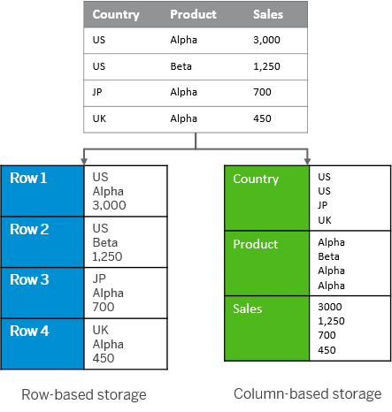

# Harnessing the Power of Apache Parquet: Revolutionizing Data Storage for Movie Streaming Giants

In the era of big data, organizations across industries are constantly seeking efficient ways to store, process, and analyze vast amounts of information. The movie streaming sector, with its ever-expanding libraries and intricate viewer data, faces unique challenges in managing data efficiently. This is where Apache Parquet steps in—a columnar storage file format optimized for use with data analysis tools. This blog post delves into the problems addressed by Apache Parquet, its utility in a production machine learning system within a movie streaming scenario, and a balanced view of its strengths and limitations. To bring our discussion to life, we'll explore practical Python examples, including benchmarking and file size comparisons.

## Addressing the Big Data Challenge

The advent of Apache Parquet emerged as a solution to a prevalent problem in data-heavy industries: managing and querying large datasets efficiently. Traditional row-oriented storage formats often fall short when it comes to analytical querying, leading to inefficiencies in time and resource consumption. 

Movie streaming services, which generate and process significants amount of data on viewer preferences, streaming logs, and content metadata, require a more sophisticated approach to data storage and retrieval to maintain their edge.

Most of these data will, at least at some time during their lifetime, be persisted onto the disk for persistent storage. This is where the concept of a data encoding scheme becomes crucial. A data encoding scheme refers to the method by which data is formatted and stored. Apache Parquet, with its columnar storage format, addresses the inefficiencies of traditional row-oriented storage by optimizing both storage space and query performance, making it an ideal choice for the complex needs of movie streaming services and other data-intensive applications. The image below illustrates the difference between columnar and row storage.



## Parquet Layout


The above image showcases the internal structure of an Apache Parquet file.

At the very start and end of the file, you have the "Magic Number," a constant that identifies the file as Parquet format.

Each file is organized into row groups, which are collections of column chunks intended to be read in a single IO operation. Inside each row group, we see individual columns (Column a, Column b, etc.) further divided into pages—units of storage containing the actual data records along with repetition and definition levels that support Parquet's complex nested data capabilities.

The pages consist of a header and data sections, the latter containing the encoded and compressed data, making Parquet files compact and efficient. On the right side of the image, the footer details critical metadata, including file version, schema, and additional key/value pairs for extended properties. This metadata encapsulates information about the row groups and columns, such as data types, encoding, path in the schema, number of values, and some statistics like the min and max values for faster lookups, which is vital for reading and processing the file efficiently.

For an analogy, you can think of these as sections in our library. Within each group, data is further organized into columns and pages. This organization is much like a book arranged into chapters and pages for easy reading.

## Parquet in Action: How Parquet can Help With Movie Streaming Platforms

In this section, we put Apache Parquet in action by appllying it to a real dataset used our team. I extracted several files from our team's codebase and try encoding them with Apache Parquet. My experiment vividly demonstrates the following properties of Apache Parquet:

- **Efficient Data Compression**: Parquet's ability to compress data at the column level leads to substantial storage savings, a key advantage for platforms dealing with massive volumes of streaming data and metadata. 

```python
csv_files = [
    'kafka_ratings_amplified.csv',
    'kafka_ratings_m2_online.csv',
    'm1_user_details.csv',
    'movie_details.csv'
]

for csv_file in csv_files:
    df = pd.read_csv(csv_file)

    # Record the size of the CSV
    csv_size = os.path.getsize(csv_file)

    # Convert to Parquet
    parquet_file = 'movies.parquet'
    start_time = time.time()
    df.to_parquet(parquet_file, engine='pyarrow')
    write_time = time.time() - start_time

    # Record the size of the Parquet file
    parquet_size = os.path.getsize(parquet_file)
    ratio = parquet_size / csv_size
    print(f"==={csv_file}===")
    print(f"CSV size: {csv_size} bytes")
    print(f"Parquet size: {parquet_size} bytes")
    print(f"parquest_size / csv_size = {ratio}")
    print(f"Time taken to write Parquet: {write_time} seconds")
```

The output of the above code snippet is shown below:

| File Name                      | CSV Size (bytes) | Parquet Size (bytes) | Size Ratio | Write Time (seconds) |
|--------------------------------|------------------|----------------------|------------|----------------------|
| kafka_ratings_amplified.csv    | 86,430,501       | 20,522,693           | 0.24       | 0.41                 |
| kafka_ratings_m2_online.csv    | 1,456,027        | 442,057              | 0.30       | 0.01                 |
| m1_user_details.csv            | 293,514          | 84,610               | 0.29       | 0.26                 |
| movie_details.csv              | 5,730,827        | 2,680,870            | 0.47       | 0.33                 |


In our experiments, the file size is compressed to nearly a quarter to one thrid of the original size, which would be a huge memory safe for movie streaming platform. Also, they all take less them half a second to complete.

- **Seamless Integration with Machine Learning Pipelines**: For movie streaming services leveraging machine learning to enhance viewer experiences, Parquet integrates smoothly with popular data processing frameworks, facilitating efficient data feeding into ML models. While our team did not operate using Parquet formats, the following python example still showcases this important property:

```python
import pandas as pd
import time
from sklearn.model_selection import train_test_split
from sklearn.ensemble import RandomForestRegressor
from sklearn.metrics import mean_squared_error

# Load the data from a CSV file and convert it to a Parquet file
df = pd.read_csv('movie_details.csv')

# For demonstration purposes, we will select a few columns relevant to building a machine learning model.
# Let's say we are trying to predict the 'vote_average' based on 'budget', 'popularity', and 'runtime'.

# Convert to Parquet
parquet_file = 'movie_details.parquet'
df.to_parquet(parquet_file, engine='pyarrow')

# Load the dataset from the Parquet file
df_parquet = pd.read_parquet(parquet_file)

# Assuming 'vote_average' is the target and 'budget', 'popularity', 'runtime' are the features.
features = ['budget', 'popularity', 'runtime']
X = df_parquet[features]
y = df_parquet['vote_average']

# Handling any potential missing values for simplicity
X.fillna(0, inplace=True)
y.fillna(y.mean(), inplace=True)

# Split the data into training and testing sets
X_train, X_test, y_train, y_test = train_test_split(X, y, test_size=0.2, random_state=42)

# Train a Random Forest Regressor
model = RandomForestRegressor(n_estimators=100, random_state=42)
start_time = time.time()
model.fit(X_train, y_train)
training_time = time.time() - start_time

# Output the training time
print(f"Training time (Parquet): {training_time:.2f} seconds")

# Predict the target on the testing set
predictions = model.predict(X_test)

# Evaluate the accuracy of the model using Mean Squared Error (MSE)
mse = mean_squared_error(y_test, predictions)

print(f"Model Mean Squared Error: {mse:.2f}")
```

The output of the above code snippet is:

| | |
|--------------------------------|------------------|
| Training time (Parquet) | 0.84 seconds |
| Model Mean Squared Error | 0.94 |

## Strengths and Limitations
Following our exploration of Apache Parquet's capabilities through practical examples and benchmarking, it's clear that Parquet offers significant advantages, particularly for data-heavy sectors like movie streaming. Its columnar storage format efficiently compresses data, reducing storage costs while accelerating query performance—a critical factor for analytics and machine learning pipelines. This enables platforms to swiftly analyze viewer behaviors and preferences, enhancing user experiences through personalized content recommendations.

However, despite its strengths, Apache Parquet is not without limitations. Its optimal performance is primarily in read-heavy scenarios, meaning that frequent data writes or updates might not be as efficient. Additionally, Parquet files can become less manageable when dealing with a vast number of small files, potentially complicating data management and processing workflows.

In essence, while Apache Parquet significantly streamlines data storage and access for analytical queries, understanding its limitations is crucial for integrating it effectively into a technology stack. For movie streaming services and other data-centric applications, leveraging Parquet's strengths while mitigating its limitations can lead to more efficient data processing and a competitive edge in the market.

### References
* Image 1 about Row- v.s. Column-oriented storage https://help.sap.com/docs/SAP_HANA_PLATFORM/52715f71adba4aaeb480d946c742d1f6/8c1fb4ff2f9640ee90e2dccea49c1739.html

* Image 2 about Apache Parquet layout visualization: https://parquet.apache.org/docs/file-format/